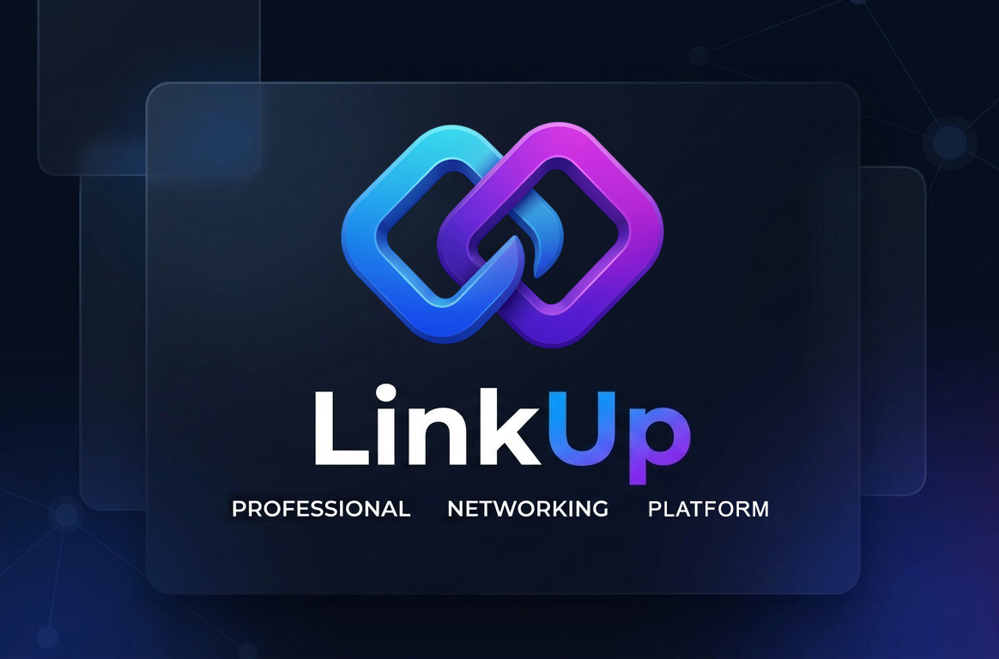

<div align="center">



<br/>
<br/>

# 🔗 LinkUp — Professional Networking, Reimagined

**An AI-powered professional networking platform with semantic search, smart match recommendations, and blazing-fast real-time messaging.**

<br/>

[](https://link-up-seven-iota.vercel.app)
[](https://github.com/yeaminfoysal/LinkUp-Backend)

<br/>


</div>

<br/>

---

## ✨ Feature Overview

### 🤖 AI-Powered Discovery

> Natural language search powered by vector embeddings and Google Gemini AI.

| Feature | Description |
| :--- | :--- |
| 🔍 **Semantic Search** | Describe who you need in plain English (e.g. *"a software engineer who live in Dhaka"*) and the AI returns ranked results using pgvector cosine similarity |
| 💡 **AI Match Insights** | Each result card shows a Gemini-generated explanation of *why* that profile matched your query |
| 📊 **Score Normalization** | Raw cosine similarity scores are normalized to a human-readable 0–100% match percentage |
| 🚦 **Rate Limit Handling** | Graceful fallback messaging when the Gemini Free Tier quota (429) is hit |

<br/>

### 🔥 Smart Matches Engine

> A deterministic recommendation system that surfaces your best connection opportunities.

- 🏷️ **Mutual Tag Visualizer** — Matching attributes (e.g. `Same University`, `Same Workplace`, `Same Skills`) are highlighted as colored visual badges directly on suggestion cards.
- ⚡ **Dynamic Connection Actions** — Send, cancel, accept, or reject friend requests directly from the suggestions grid without navigating away.

<br/>

### 💬 Real-Time Chat System

> A feature-rich messaging experience powered by Socket.IO.

| Feature | Description |
| :--- | :--- |
| 💬 **Direct Messaging** | One-on-one conversations with real-time delivery |
| 👥 **Group Chats** | Create named group conversations, invite friends, and leave groups |
| 📎 **Message Types** | Text, image uploads, and file attachments |
| 😄 **Emoji Reactions** | React to any message with an emoji picker; reaction counts shown inline |
| ↩️ **Reply Threads** | Reply to a specific message with a quoted preview inside the bubble |
| ✏️ **Edit & Delete** | Edit your own text messages or soft-delete any of your messages |
| ✅ **Read Receipts** | Double blue checkmarks when a message has been read by the recipient |
| ⌨️ **Typing Indicators** | Live "X is typing…" animation when the other party is composing |
| 🖼️ **Shared Media Panel** | A collapsible right panel shows shared photos and group member list |
| 🚫 **Block / Unblock** | Block a user from within any conversation; blocked state disables the input with a clear UI banner |
| ♾️ **Infinite Scroll** | Older messages are paginated and loaded on upward scroll with stable scroll position restoration |
| 🟢 **Online Presence** | Live green dot badges reflect who is currently active on the platform |

<br/>

### 📝 Social Feed

> A dynamic timeline for sharing professional updates and achievements.

| Feature | Description |
| :--- | :--- |
| ✍️ **Create Posts** | Rich text posts with support for multiple image uploads in a single post |
| 🖼️ **Media Grid Layout** | 1, 2, or 3-column adaptive image grid with a "+N more" overflow indicator |
| ✏️ **Edit & Delete Posts** | Owners can edit post content or delete posts from the feed |
| 🔒 **Post Visibility** | Three privacy levels: Public, Friends Only, and Private |
| ❤️ **Like / Unlike** | Like posts with an animated counter; view the full list of who liked via a modal |
| 💬 **Comments & Replies** | Nested comment threads with reply support |
| 🔖 **Save / Unsave** | Bookmark posts to a personal saved collection |
| 🗂️ **Feed Tabs** | Switch between *For You*, *Friends Only*, and *Trending* content feeds |
| 🔎 **Fullscreen Media Viewer** | Click any image on a post to open a lightbox overlay |

<br/>

### 👤 User Profiles

> Rich, editable public profiles with professional detail fields.

- 🪪 **Profile Page** — Name, username, avatar, bio, join date, and a post grid.
- 💼 **Professional Details** — Dedicated fields for Location, Profession, Workplace, University, Department, Skills, and Interests — each rendered as a visual chip/badge.
- 🎨 **Cover Photo** — Gradient cover banner with an overlapping circular avatar.
- 📝 **Edit Profile Modal** — Inline form to update avatar, bio, and all professional fields.
- 🤝 **Friendship Actions** — Add Friend, Accept / Reject incoming request, Cancel sent request, Unfriend — all accessible from the profile header.
- 💌 **Message Button** — Opens or creates a direct conversation directly from a profile page.
- 🚫 **Block / Unblock** — Block any user from their profile; a warning banner is shown when a blocked profile is viewed.

<br/>

### 🫂 Friends & Connections

> Full lifecycle management of your professional connections.

- 👥 **All Friends** — View and manage your full friends list.
- 📥 **Pending Requests** — Accept or reject incoming friend requests with a badge count.
- 📤 **Sent Requests** — Review and cancel pending outgoing requests.
- 🚫 **Blocked Users** — View and unblock previously blocked users.
- 💡 **People You May Know** — Friend suggestion cards with shared-context tags.

<br/>

### 🔔 Notifications

> Stay informed about relevant social activity.

- 🔔 **Notification Types** — New Message, Post Liked, Post Commented, and Friend Request notifications.
- 🔴 **Unread Badge** — Live unread count badge on the sidebar navigation icon.
- ✅ **Mark as Read** — Click individual notifications to mark them read, or use "Mark all read" in bulk.
- 🔗 **Smart Linking** — Notifications deep-link directly to the relevant conversation or feed.

<br/>

### 👥 Groups

> Dedicated group chat management outside the main messages view.

- ➕ **Create Groups** — Name a group and select members from your friends list with a checkmark UI.
- 💬 **Group Chat** — Full feature parity with direct messaging (reactions, replies, typing, media).
- 👤 **Member List** — Group info panel shows all members, their roles, and online status.
- 🚪 **Leave Group** — One-click leave action from the info panel.

<br/>

### 🛡️ Authentication & Security

> Robust, stateless auth flow with full account recovery.

- 🔐 **Register / Login** — JWT-secured registration and login with Zod schema validation on the client.
- 📧 **Forgot Password** — Email-based password reset initiation.
- 🔁 **Reset Password** — Token-validated password reset form.
- 💾 **Persistent Sessions** — Auth state hydrated from localStorage on page load via a custom hydration hook.
- 🛤️ **Protected Routes** — Middleware-level route guards redirect unauthenticated users.

<br/>

### ⚙️ Settings

- 🌗 **Theme Switcher** — Toggle between Light Mode and Dark Mode with a visual card selector (powered by `next-themes`).
- 🪪 **Account Overview** — Quick display of current user name, username, and email.
- 🛡️ **Security Tips** — Inline guidance on session and token safety.

<br/>

### 🔑 Admin Panel

> A restricted dashboard for platform administrators (Super Admin only).

- 📋 **User Table** — Full list of all platform users, sortable by last activity or joined date.
- 📊 **Total Users Count** — Live stat card showing the total number of registered users.
- 🟢 **Online Status** — See which users are currently online on the platform in real time.
- 🤝 **Friends Count** — View each user's total friends count directly from the dashboard.

---

## 🛠️ Tech Stack

### 🖥️ Frontend

| Technology | Role |
| :--- | :--- |
| [Next.js 16](https://nextjs.org/) | React framework, App Router, SSR/CSR |
| [React 19](https://reactjs.org/) | UI component library |
| [TypeScript](https://www.typescriptlang.org/) | Type-safe development |
| [Tailwind CSS v4](https://tailwindcss.com/) | Utility-first CSS framework |
| [Framer Motion](https://www.framer-motion.com/) | Page & component animations |
| [Zustand](https://zustand-demo.pmnd.rs/) | Global client state (auth, chat, UI) |
| [TanStack Query v5](https://tanstack.com/query/latest) | Server state fetching, caching & mutations |
| [React Hook Form](https://react-hook-form.com/) + [Zod](https://zod.dev/) | Validated, type-safe forms |
| [Axios](https://axios-http.com/) | HTTP API client |
| [Socket.IO Client](https://socket.io/) | Real-time WebSocket communication |
| [next-themes](https://github.com/pacocoursey/next-themes) | Dark / Light mode theming |
| [Lucide React](https://lucide.dev/) | Icon library |
| [date-fns](https://date-fns.org/) | Date formatting utilities |

### 🗄️ Backend

| Technology | Role |
| :--- | :--- |
| [NestJS](https://nestjs.com/) | Progressive Node.js framework for scalable APIs |
| [Prisma](https://www.prisma.io/) | Next-generation TypeScript ORM |
| [PostgreSQL](https://www.postgresql.org/) | Primary relational database |
| [pgvector](https://github.com/pgvector/pgvector) | Vector similarity search for AI matching |
| [Google Gemini AI](https://ai.google.dev/) | Embeddings generation + match reasoning |
| [Socket.IO](https://socket.io/) | Real-time bidirectional event server |
| [Passport.js](https://www.passportjs.org/) + JWT | Stateless authentication & authorization |
| [Cloudinary](https://cloudinary.com/) | Cloud image & file upload management |

---

## 🚀 Getting Started

### Prerequisites

- Node.js **v18+**
- npm

### 1️⃣ Clone the repository

```bash
git clone https://github.com/yeaminfoysal/LinkUp-Frontend.git
cd LinkUp-Frontend
```

### 2️⃣ Install dependencies

```bash
npm install
```

### 3️⃣ Configure environment variables

Create a `.env.local` file in the project root:

```env
NEXT_PUBLIC_API_URL=http://localhost:3001/api/v1
NEXT_PUBLIC_SOCKET_URL=http://localhost:3001
```

### 4️⃣ Run the development server

```bash
npm run dev
```

Open [http://localhost:3000](http://localhost:3000) in your browser. 🎉

### 5️⃣ Build for production

```bash
npm run build
npm start
```

---

## 📁 Project Structure

```
src/
├── app/                    # Next.js App Router pages
│   ├── (main)/             # Authenticated layout group
│   │   ├── feed/           # Social feed
│   │   ├── messages/       # Chat (list + [conversationId])
│   │   ├── discovery/      # AI-powered user search
│   │   ├── matches/        # Smart match recommendations
│   │   ├── friends/        # Friends management
│   │   ├── groups/         # Group chat management
│   │   ├── notifications/  # Notification center
│   │   ├── profile/        # User profiles ([username])
│   │   ├── saved/          # Saved posts
│   │   ├── settings/       # App settings
│   │   └── admin/          # Admin dashboard
│   └── auth/               # Login, Register, Password reset
├── modules/                # Feature modules (components/hooks/services)
│   ├── auth/
│   ├── chat/
│   ├── feed/
│   ├── friends/
│   ├── posts/
│   ├── profile/
│   └── admin/
├── components/
│   ├── shared/             # Reusable cross-feature components
│   └── ui/                 # Base UI primitives (Button, Modal, Input…)
├── store/                  # Zustand global stores
├── services/               # Axios API layer
├── socket/                 # Socket.IO client + event handlers
├── hooks/                  # Global custom hooks
└── types/                  # TypeScript type definitions
```

---

## 🧗 Challenges I Faced

- **⚡ Managing Global State with WebSockets** — Ensuring incoming socket events smoothly updated the UI without unnecessary re-renders was tricky. I solved it by combining Zustand for global client state with TanStack Query for server-state caching — socket events update stores directly while query cache invalidation keeps data fresh.
- **📐 AI Search Score Normalization** — Raw pgvector cosine similarity scores clustered around 0.6–0.7, which looked artificially low to users. I implemented a custom normalization formula that scales scores to a human-readable 0–100% range without losing relative ranking order.
- **📜 Infinite Scroll Without Jumping** — Loading older messages on upward scroll caused the view to jump. I fixed it by diffing `scrollHeight` before and after each page append and restoring the exact scroll offset.
- **🚦 Handling AI API Quotas Gracefully** — The Gemini Free Tier rate limit (429 Too Many Requests) would break the discovery page. I built robust error states that gracefully fall back to default messaging when the quota is hit.
- **🔄 Keeping Read Receipts & Presence in Sync** — Read states, typing indicators, and online presence all arrive over different socket events. Coordinating them across the conversation list, chat window, and profile pages required a carefully structured chat store with per-conversation state.

---

## 🔮 Future Enhancements

- 📞 **Video & Audio Calling** — WebRTC integration for direct calls from the chat interface.
- 🌐 **Internationalization (i18n)** — Multi-language support for a global audience.
- 📊 **Analytics Dashboard** — Profile view counts, connection growth charts, and post performance metrics.
- 🔍 **Global Search** — Unified search bar for users, posts, and conversations.
- 📱 **Progressive Web App (PWA)** — Offline support and home screen installation.

---

<div align="center">
<!-- 
**Built with ❤️ by [Yeamin Foysal](https://github.com/yeaminfoysal)** -->

⭐ Star this repo if you find it helpful!

</div>
